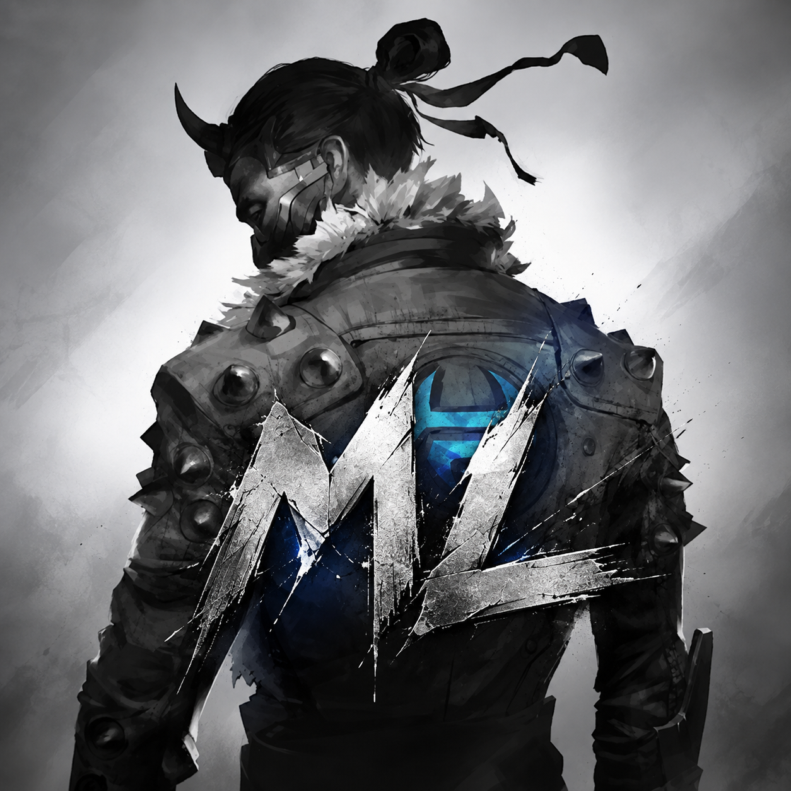

# Mod Loader



A Kotlin and Jetpack Compose mod library for **Shadow Fight Arena** on Android 11 and newer. It uses a Shizuku user service to manage mod archives, verify file integrity, preserve original files, and apply extensionless payloads to the game’s external storage.

**GNU GPLv3 (GPL-3.0-only).** Covered code and documentation are licensed under GNU GPL version 3. Redistribution and derivative works must comply with its source-sharing requirements. GPLv3 permits commercial use. Third-party dependencies retain their own licenses.

[Download the signed release APK](https://github.com/Kohlrabenschwarz/Mod-Loader/releases/latest) · [Android Studio guide](ANDROID_STUDIO.md) · [Mod ZIP format](examples/TEMPLATE.md) · [Credits](CREDITS.md)

## Requirements

- Android 11/API 30 or newer, using the primary Android user.
- [Shizuku](https://shizuku.rikka.app/) running through ADB/wireless debugging with shell UID 2000. Root/Sui and work profiles are not supported by this build.
- Shadow Fight Arena installed, with its game data downloaded and the Bundles directory created.
- Enough free space for the archive, staging files, original backups, and recovery copies.

The target is fixed:

```text
Package: com.nekki.shadowfightarena
/storage/emulated/0/Android/data/com.nekki.shadowfightarena/files/gamedata/Resources/Bundles/
```

Shizuku does not guarantee access on every Android version or OEM build. This application changes external game files; it does not patch APKs, inject native code into processes, or verify that a mod is compatible with a particular Unity/game version.

## Install and use

1. Download `Mod-Loader-v0.9.0-release.apk` from Releases and install it.
2. Start Shizuku, open Mod Loader, and grant its Shizuku permission when requested. The app tries to connect up to three times; the status turns green when ready.
3. Tap **+** to import a mod ZIP. Each card shows its icon, name, creator, description, and affected files. Tap the card to expand its details.
4. Enable or disable a mod using its switch. The engine stops the game before changing files. Use **Play** above the + button to launch it again.
5. Hold a card to recover or delete a mod. Use Settings for English, Turkish, Hindi, Simplified Chinese, Russian, or German, dark mode, and six accent colors.

**Migrating from older builds:** versions before 0.9.0 used `dev.modloader.app`; this release uses `dev.kohlrabenschwarz.ml` and the maintainer-supplied signing certificate. Android treats the new package as a separate application. Back up your ZIPs, finish pending operations, and deactivate active mods in the old app before switching. Do not run both loaders against the same game files. Local preferences and unarchived imports are not transferred across application IDs; reimport those ZIPs. Existing archives in `Bundles/mods/` can be rediscovered through Shizuku. Future updates with the same application ID and signing certificate install over this release.

The header displays the app name, version, and full SHA-256 of the installed base APK. This is an APK checksum, not the signing certificate fingerprint.

## App updates

The app checks the latest published stable release from `Kohlrabenschwarz/Mod-Loader` on GitHub at startup. Settings also provides **Check for updates**, limited to one attempt per minute. A newer version displays a **Download update** button. The download opens the canonical GitHub APK asset in your browser; open the downloaded APK and confirm installation in Android. Downloads and installation are user-controlled, not silent.

Only tags of the form `vMAJOR.MINOR.PATCH` and an uploaded asset named `Mod-Loader-vMAJOR.MINOR.PATCH-release.apk` are accepted. Drafts, prereleases, malformed versions, and external download links are ignored. Pushing source or a tag alone does not create an update: publish a GitHub Release containing the signed APK and mark it latest. Keep version codes increasing and sign every update with the same maintainer key.

The app sends a normal HTTPS request to GitHub without authentication, mod contents, device identifiers, or telemetry. GitHub receives ordinary connection metadata such as the IP address. Offline/rate-limit failures do not block mod management. No automatic-install permission is requested.

## Storage and recovery

```text
Bundles/
├── <game files and active mod payloads>
└── mods/
    └── <mod-name>/
        ├── <mod-name>.zip
        ├── state.json
        ├── sha.json
        └── backup/
            └── <transaction-id>/
                ├── journal.json
                ├── old/                 # Original files
                ├── before-recovery/     # Files preserved before explicit recovery
                └── recovery-sha.json    # Snapshot used to resume explicit recovery
```

`mods/` is created on the first successful privileged connection, not at Android package installation time. `state.json` and transaction journals are authoritative; the app’s local flags cache the last known state for offline display. Reconnection reconciles those flags with disk state.

Activation verifies the ZIP, stages its payload, saves and verifies all original files, and then replaces each destination through an atomic rename. Deactivation removes files newly added by the mod and restores overwritten originals. Overlapping active mods are rejected. Ordinary Delete restores an active mod before removing its archive and backups.

Changes are atomic **per file**, not across the entire mod. Interrupted operations resume recovery at the next successful connection. Losing Shizuku prevents immediate recovery; cancelling the UI coroutine does not cancel a synchronous remote Binder operation. Backups are not encrypted and are stored in the game’s external data directory. Clearing game data can remove them.

### SHA warnings

Each mod’s `sha.json` records both `originalSha256` and `modifiedSha256`; a null original hash means that file originally did not exist. Active files are compared with mod hashes, and inactive files with their original hashes. Checks run on connection, after operations, and when returning to the app.

If files were updated, removed, or changed by another tool, a warning appears at the card’s bottom right. It provides:

- **Delete:** after confirmation, discard the mod archive and all backups while leaving current game files unchanged. Incomplete transactions retain their recovery data and must be resolved first.
- **Recover base files:** after confirmation, restore verified originals, which may predate a game update. Current files are preserved under `before-recovery/` before replacement, and files originally added by the mod are removed. A never-activated mod has no original-file backup to restore. Recovery stops if files change again after the snapshot.
- **Ignore this warning:** choose whether the warning should return the next time you return to the app or remain hidden. This changes presentation only; integrity checks remain enabled. Hold the card to reopen a hidden warning.

The original transaction journal remains the authority for recovery. Editing `sha.json` cannot authorize arbitrary replacements. Preserved recovery copies are removed with the mod or when a later activation replaces the previous backup set.

## Mod packages

```text
my-mod.zip
├── info.json
├── icon.png               # Optional
└── payload/
    ├── 5a9e13d8bc7844df970f612ea7d306c2
    └── b074ce9261ad4e8ab2597380cfed615a
```

No `.bundle` extension is required. Names and bytes are preserved. The manifest’s `affectedFiles` must match the actual payload. `info.json` and icon files are never copied over game files.

Use [the generic template](examples/generic-mod-template.zip) and [the format guide](examples/TEMPLATE.md). Its payload contains dummy test data, not working Unity AssetBundles. It is intended for import/metadata testing, not gameplay.

## Architecture

| Module | Responsibility |
| --- | --- |
| `domain` | Fixed target, path policies, ZIP validation, models, repository contracts, JVM tests |
| `engine` | AIDL service, privileged file access, managed archives, journals, backup/recovery, Android tests |
| `bridge` | Shizuku lifecycle, permission handling, file-descriptor transport, coroutine/Flow adapter |
| `app` | Compose UI, local imports, persistent preferences, localization, launch intent, previews |

Limits: 256 MiB ZIP, 256 MiB per payload file, 512 MiB total expanded payload, 200 archive entries, 200:1 compression ratio, 4 MiB icon, 2048 × 2048 icon dimensions, and a 32 MiB free-space reserve. Payload I/O uses 64 KiB buffers. ZIP64, encrypted entries, symlinks, special files, traversal, collisions, and payloads targeting the reserved `Bundles/mods/` directory are rejected.

The service authenticates Binder callers and restricts the target package and user. Its `lstat` checks still have a time-of-check/time-of-use window; this is not hardened against malicious concurrent directory replacement. A directory-FD/JNI backend would be required to address that threat model.

## Build

Use JDK 17 or 21 and Android SDK Platform 35. The checked-in wrapper uses Gradle 8.10.2; AGP is 8.8.2 and Kotlin is 2.1.20. Current version: **0.9.0**, version code **12**, application ID **dev.kohlrabenschwarz.ml**.

```sh
./gradlew :domain:test :app:assembleDebug :app:lintDebug
./gradlew :engine:assembleDebugAndroidTest
# Run only on an isolated Android test device:
./gradlew :engine:connectedDebugAndroidTest
```

On Windows use `gradlew.bat`. See [ANDROID_STUDIO.md](ANDROID_STUDIO.md) for UI previews and [docs/RELEASING.md](docs/RELEASING.md) for release signing. No private signing keys, passwords, local SDK paths, build caches, or real game/mod payloads are committed.

## Verification

The project has passing JVM parser/path tests, builds debug and minified release variants, and compiles the Android test APK. The first public release has **not been installed or gameplay-tested on a physical device in this workspace**. Do not interpret a successful build as verified compatibility with every device or game update. Exact checks and remaining limitations are in [VALIDATION.md](VALIDATION.md).

## License and credits

Original project code and documentation are licensed under [GNU GPL version 3](LICENSE), **GPL-3.0-only**, Copyright (c) 2026 **Kohlrabenschwarz** and contributors for their respective contributions. There is no additional noncommercial restriction. GPLv3's terms govern distribution, modifications, and corresponding source. Game artwork and trademarks are excluded; see [CREDITS.md](CREDITS.md).

- Maintainer: [Kohlrabenschwarz](https://github.com/Kohlrabenschwarz).
- Shizuku API: RikkaApps and contributors; Android/Jetpack: Google and the Android Open Source Project; Kotlin/coroutines: JetBrains and contributors; Gradle: Gradle contributors.
- Launcher artwork: a maintainer-supplied edit of legacy Shadow Fight game artwork with an “ML” overlay. Underlying artwork and game trademarks remain with their respective owners, including Nekki. This is an unofficial project, not endorsed by the game’s creators.
- **Code changes and this README were prepared with OpenAI Codex (GPT-6 Astra).**

See [CREDITS.md](CREDITS.md), [THIRD_PARTY_NOTICES.md](THIRD_PARTY_NOTICES.md), and [third-party licenses](licenses/third-party/) for attribution and license texts.
